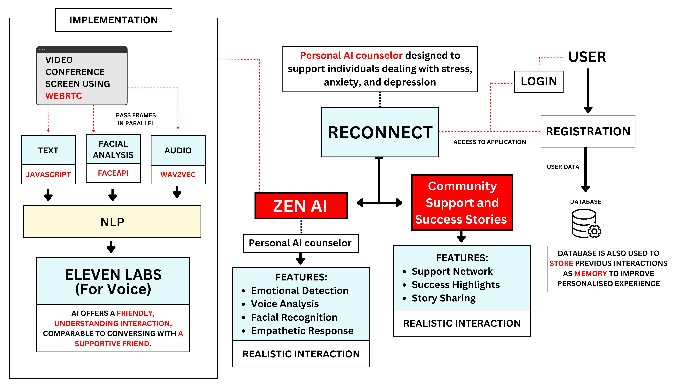

# Reconnect: Rehabilitation Online with Zen-AI

## Overview

**Reconnect: Rehabilitation Online** is a uniquely crafted, AI-powered mental health and emotional support platform. It is designed to bring solace to individuals navigating through the waves of stress, anxiety, and depression. At its heart lies **Zen AI**, a deeply empathetic personal AI counselor, whose gentle guidance comes through the symphony of voice, facial recognition, and text-based interaction. Privacy and security are woven deeply into the platform’s essence, ensuring that every whisper of the user’s emotions remains protected.

 

Through community-driven experiences, users can share their stories of triumph and healing, and find strength in the wisdom of others, creating a virtual embrace of hope and solidarity.

## Features

### Zen AI - Personal AI Counselor
Zen AI serves as a beacon of understanding, merging modern technology with heartfelt emotional intelligence:
- **Emotion Detection**: With a precision that borders on the intuitive, it analyzes text, audio, and facial expressions in real-time, using **NLP**, **wav2vec2**, and **FaceAPI** technologies.
- **Voice Interaction**: The **Eleven Labs API** breathes life into a voice that speaks with warmth and sincerity, offering a conversation that feels human and kind.
- **Facial Emotion Recognition**: Through **FaceAPI**, the platform recognizes subtle shifts in facial expressions, offering responses that resonate with the user’s emotional state.
- **Empathetic Responses**: By weaving together insights from multiple inputs, Zen AI crafts responses that are both thoughtful and personalized, nurturing the user through their emotional journey.

### Community Support
- **Support Network**: Users can connect with others traveling similar paths, creating a shared space of comfort and understanding.
- **Success Stories**: Discover blogs and stories that shine a light on personal victories over mental health challenges, offering inspiration and camaraderie.

### Real-Time, Secure Interactions
- **WebRTC**: Ensuring seamless real-time video and voice communication.
- **Personalization**: User interactions are stored with care and privacy, allowing Zen AI to remember and tailor responses to individual experiences.

## Tech Stack

### Frontend
- **React.js**: Powers a fluid, responsive user interface designed for ease of use and accessibility.
- **WebRTC**: Supports the real-time audio and visual interactions that form the backbone of Zen AI’s presence.
- **JavaScript**: Facilitates the logic and dynamic behavior on the client-side.

### Backend
- **Node.js** with **Express.js**: The beating heart of the backend API, handling everything from user authentication to session management.
- **MongoDB**: A secure repository for user data and interactions, ensuring privacy and security.
- **Eleven Labs API**: Lends a natural voice to Zen AI, enabling soothing and realistic responses during interactions.

### Machine Learning (Python)
- **wav2vec2**: Extracts and interprets emotional nuances from voice data in real-time.
- **FaceAPI**: A sensitive observer of facial expressions, capable of recognizing emotions from even the subtlest of changes.
- **NLP**: Harnesses the power of language to understand and analyze emotional cues in text.
- **Flask**: Facilitates the processing and serving of the machine learning models, creating a seamless flow of data between the user and Zen AI.

## Technical Approach

The system is a harmonious blend of cutting-edge technology and empathetic design, processing user inputs in real-time to provide responsive, personalized emotional support:
1. **User Interaction**: As users engage through video conferencing (via WebRTC), the system analyzes text, audio, and video in tandem, feeding this data to the emotion-detection models.
2. **Emotion Detection**: Through **wav2vec2**, **FaceAPI**, and **NLP**, Zen AI deciphers emotional cues from multiple input streams, transforming raw data into insights about the user’s mental state.
3. **Voice Response**: Using the emotional feedback, Zen AI generates a personalized, comforting response via the **Eleven Labs API**, ensuring a voice that feels genuine and compassionate.
4. **Community Support**: For those seeking collective strength, the platform offers access to community blogs and stories, fostering an atmosphere of mutual support and shared healing.

## Challenges and Future Enhancements

### Challenges
- **Real-Time Processing**: Balancing speed and accuracy in real-time emotional detection was a considerable technical hurdle, ensuring that responses feel natural without introducing delays.
- **Emotion Detection Accuracy**: Emotions are complex and multifaceted, and capturing the full spectrum—across different cultures and expressions—remains an ongoing challenge.
- **Ethics and Privacy**: Protecting users’ emotional data, while also providing meaningful insights, is a delicate balance that we continue to refine.

### Future Enhancements
- **Advanced Emotional Understanding**: Future iterations will build upon a broader dataset to enhance emotional accuracy and sensitivity, pushing the boundaries of what AI can understand.
- **Mobile Integration**: Expanding to mobile platforms will ensure that users can connect with Zen AI and the community from anywhere, at any time.
- **Multilingual Support**: Language should never be a barrier to healing, so the platform’s next evolution will introduce support for multiple languages, opening the doors to a global audience.

## Contact

- **Dhanush B** (Developer & Designer): [LinkedIn](https://www.linkedin.com/in/dhanush-b-469306249/) | talktodhanush4554@gmail.com | +91 8618541131
- **Dhanush U**
- **Dhanush N Prabhu**
- **Dhanush K Gowda**